# Linux通过虚拟机上网


> 在很多高校中，linux上网一直是一个没办法解决到事，因为没有linux版本的锐捷等客户端，虽然有大神很早之前就开发出了代替到工具:`mentohust`，但是`mentohust`在一些学校并不能够使用。


所以这里提供一种勉强代替的办法供参考，如果要完美的话，还需要期望 [rovo98](https://github.com/rovo98) 修改`mentohust`，来实现锐捷的验证。写在前面，这里要感谢一下 [Adj325](https://github.com/Adj325) 以及某位小师弟的帮助。文末附上命令处理方式。

---

`废话不多说，这里的话就是利用虚拟机，在虚拟机中使用锐捷拨号上网，然后把虚拟机当作主机的网关，转发主机的数据包。`

---


### 第一步:选择桥接模式，好让虚拟机能够拨通锐捷上网。这里使用virtualbox安装使用虚拟机。

> 这里附上一张桥接网络拓扑图

​​​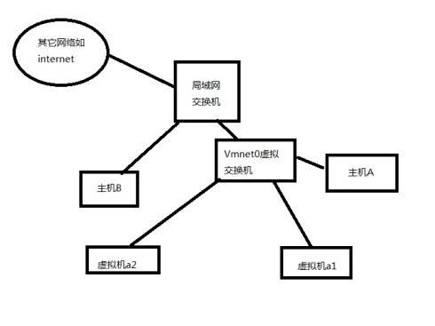

- 虚拟机在关机状态下，选择中虚拟机后，点击设置

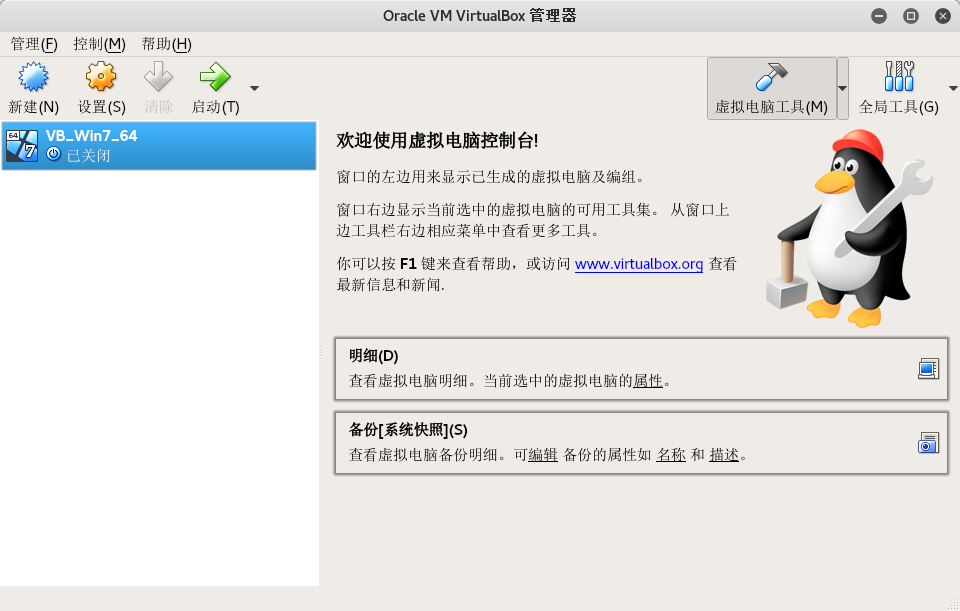


- 选中网络，并选择其中一块虚拟网卡，连接方式选择桥接网卡，界面名称选择能够正常使用到一块本地网卡即可。

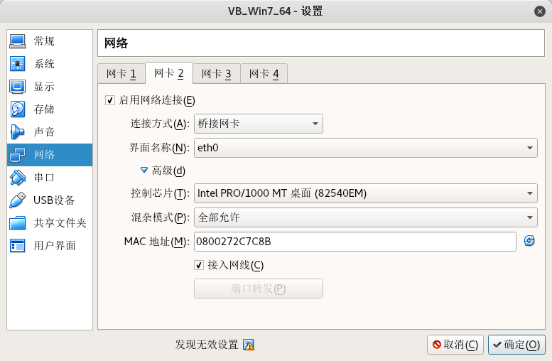

- 虚拟机开机，进入网络共享中心，更改设配器设置，然后选择上一步选择了桥接模式的那块网卡（其他有线网卡需要禁用，否则无法连接锐捷），然后设置一下ip地址什么的，根据你的锐捷要求设置。

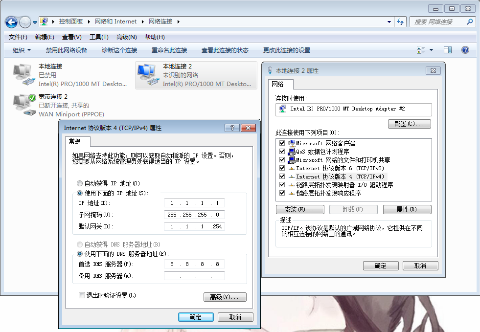

- 连接锐捷，宽带拨号，自此，虚拟机就能正常上网了。


### 第二步:虚拟机开启ip转发，充当主机到路由(*这步省略了如果没问题，也可不设置*），同时设置宽带连接为共享的，主机设置虚拟机为自己到网关，进而上网。

> 设置虚拟机

- 虚拟机中修改注册表，开启ip转发功能（**可选**）
  - win+r打开运行，输入regedit回车
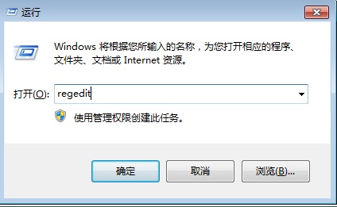
  - 然后修改`HKEY_LOCAL_MACHINE\SYSTEM\CurrentControlSet\services\Tcpip\Parameters`中到`IPEnableRouter`的值为1。

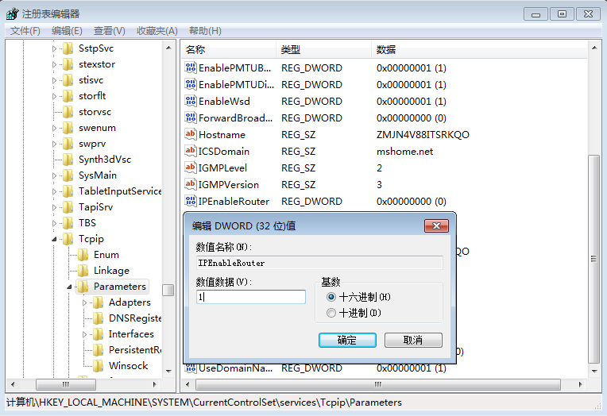

- 开启相关的服务,将`Routing and Remote Access`服务启动，并在属性中设置为自动。（**可选**）

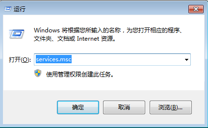

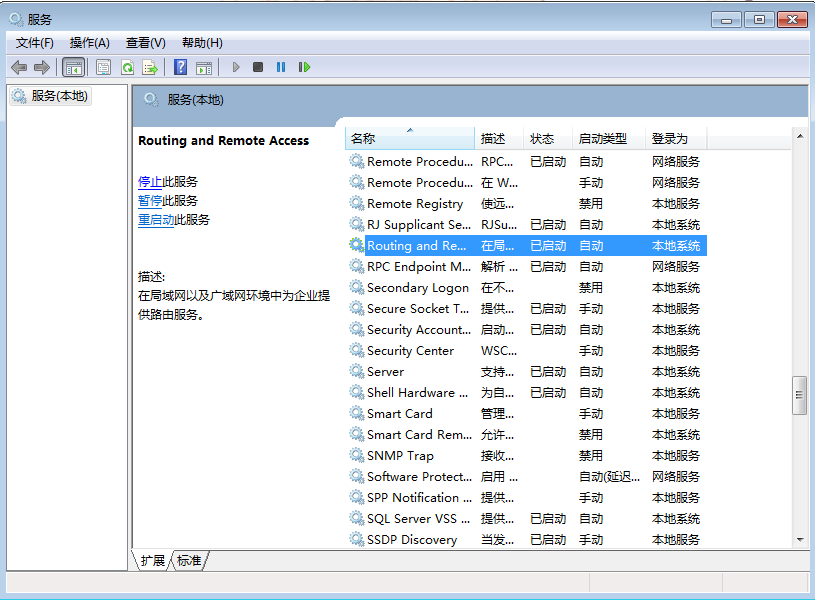

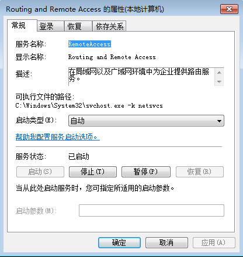


- 开启防火墙，否则，宽带共享时可能会出现错误。（**必选**）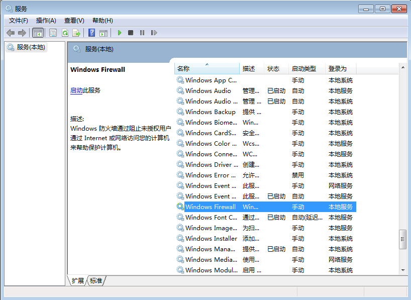

- 宽带共享(**必选**)

  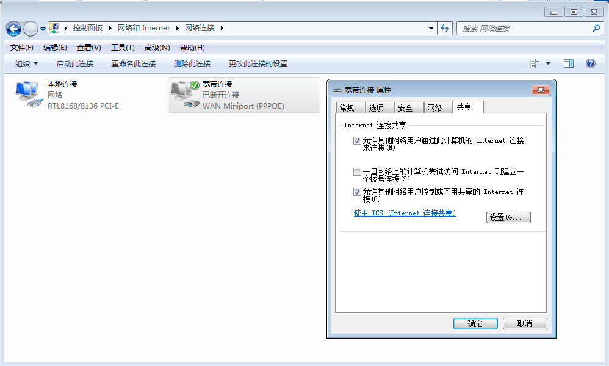

  此处共享时可能会出现错误，如上所说，将防火墙开启即可。

> 到这里虚拟机就设置完毕了，开始设置linux主机（可自行使用图形界面的添加网络配置，ip，netmask，gateway(设置为虚拟机ip)，dns设置好就可以了，以下就可以跳过了）

- 将eth0(上面选择到那张网卡)设置一下ip,跟虚拟机中的ip在同一网段下，ping一下虚拟机，检查是否能互相通信。

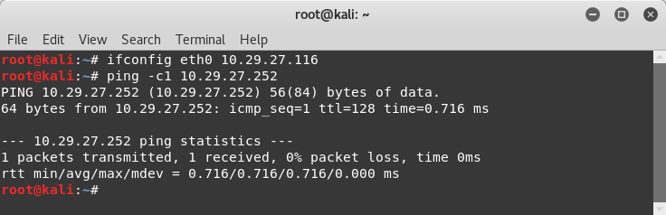

> (这里只是临时设置，需要的话，修改一下`/etc/network/interfaces`或者是`/etc/sysconfig/network-scripts/ifcfg-eth0`，对应Debian系列和CentOS系列)
>

- 修改路由表，添加一条默认路由，使得所有ip都通过网关(虚拟机)来转发，忽略我第二条路由

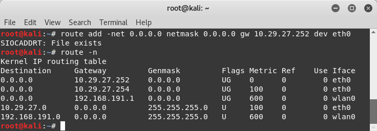

- 设置一下dns

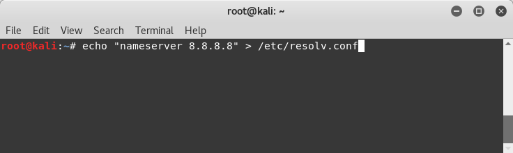


#### OK，到了此处，大功告成，宿主机就能正常地上网了。


**这是一条分割线**

---

> 大概以下的东西就可以解决了，虚拟机ip（通过锐捷上网的）是10.29.27.252，Linux主机的话，就随意了，这里是10.29.27.116，同个网段下就可以了。其他的根据自己的情况自行修改。
>
> Linux的话，也可以直接添加一个网络连接配置后，直接把网关设置为虚拟机ip即可，以后开机也不用重复设置。

```bat
::Window虚拟机下
::设置本地连接的ip mask gateway dns
netsh interface ip set address name="本地连接" source=static addr=10.29.27.252 mask=255.255.255.0 gateway=10.29.27.254 1
netsh interface ip set dns name="本地连接" source=static addr=8.8.8.8
::将防火墙设置为开机自启，并开启
sc config MpsSvc start=auto
net start MpsSvc
::开启宽带连接的共享，自行手动设置
::**非必选步骤**
::sc config RemoteAccess start=auto
::net start RemoteAccess
::reg add HKEY_LOCAL_MACHINE\SYSTEM\CurrentControlSet\services\Tcpip\Parameters /v IPEnableRouter /t REG_DWORD /d 1 /f
```

```sh
#linux主机设置
ifconfig eth0 10.29.27.116/24 up
route add default gw 10.29.27.252 dev eth0
echo 8.8.8.8>/etc/resolv.conf
#可以将配置添加到/etc/sysconfig/network-scripts/ifcfg-eth0或者是/etc/networks/interfaces中，来使得设置永久生效，选择哪个文件具体看自己Linux的发行版本。
```
**这是设置宿主机和虚拟机的ip是为了让两者可以互相通信，处于同一网段下，至于宿主机的gateway设置为虚拟机就可以了，也可添加默认路由后解决。**


**这又是一条分割线**

---

啰嗦几句:

1. virtualbox等虚拟机安装的时候是需要编译进内核的，所以需要重新编译内核，kali的话，可以参考一下[此文](https://github.com/dcLunatic/Linux-learning/blob/master/%E5%85%B3%E4%BA%8EKali%20Linux%E5%AE%89%E8%A3%85Virtualbox%E5%87%BA%E7%8E%B0%E9%9C%80%E8%A6%81%E9%87%8D%E6%96%B0%E5%AE%89%E8%A3%85%E5%A4%B4%E6%96%87%E4%BB%B6%E7%9A%84%E9%97%AE%E9%A2%98.md)。
2. virtualbox也可以使用其他到虚拟化环境来代替，如VMware Workstation，或者是KVM(KVM的话，需要手动安装一些磁盘加速virtIO等驱动)
